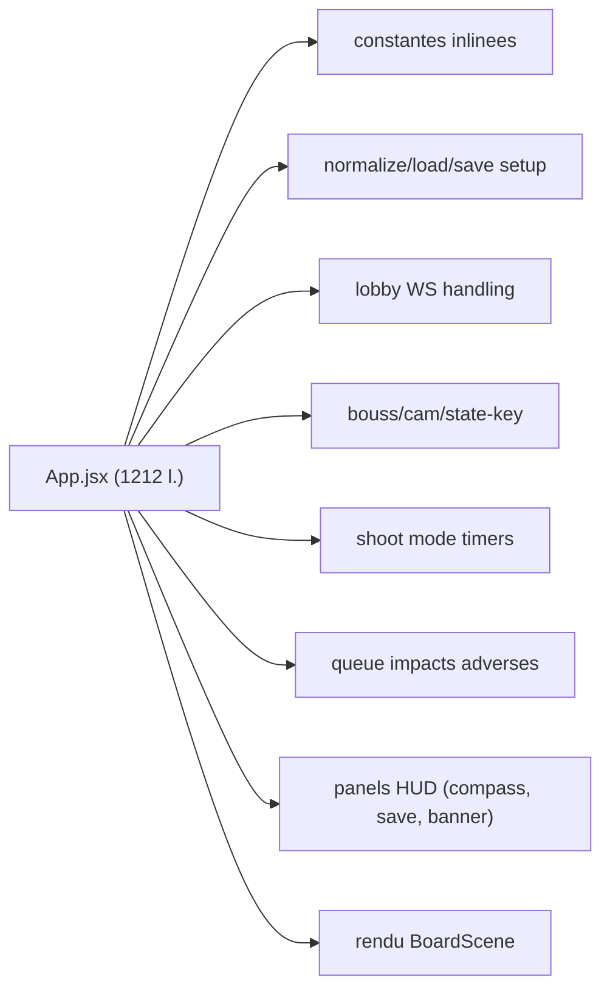

# Audit Refactor Front-end — Rapport

> Date : 2026-05-06
> Stack : React 19 + Vite 8 + Three.js + React Three Fiber (+ drei)
> Périmètre : `app/frontend/`
> Décisions de cadrage : rester en JS/JSX (JSDoc + ESLint strict React) ; livrable unique = ce rapport, aucun code modifié.

---

## Sommaire

1. [Synthèse exécutive](#1-synthèse-exécutive)
2. [Diagnostic & extractions par fichier](#2-diagnostic--extractions-par-fichier)
3. [Arborescence cible](#3-arborescence-cible)
4. [Configuration ESLint stricte cible](#4-configuration-eslint-stricte-cible)
5. [Conventions & principes React appliqués](#5-conventions--principes-react-appliqués)
6. [Roadmap d'implémentation post-validation](#6-roadmap-dimplémentation-post-validation)
7. [Annexes — Tableaux récapitulatifs](#7-annexes--tableaux-récapitulatifs)

---

## 1. Synthèse exécutive

Le front-end est fonctionnel et déjà découpé entre `components/`, `hooks/`, `api/`, `utils/`, `config/`, `shaders/`. Toutefois trois fichiers concentrent l'essentiel de la dette structurelle :

| Fichier | Lignes | Constat |
| --- | ---: | --- |
| [`src/App.jsx`](src/App.jsx) | **1212** | God-component : routing d'écran + persistance localStorage + lobby WebSocket + animation des impacts adverses + mode tir + boussole/caméra + panneaux UI + scène. |
| [`src/components/BoardScene.jsx`](src/components/BoardScene.jsx) | **379** | Contient deux sous-composants 3D internes (`PerformanceProbe`, `CameraDirector`) avec leur logique de transition arc/Bezier et de presets caméra. |
| [`src/components/WaterBoard.jsx`](src/components/WaterBoard.jsx) | **419** | Mêle vague CPU, rendu grille, overlays cellules, prévisualisation, particules d'impact et highlight survol. |

S'y ajoutent :

| Fichier | Lignes | Constat |
| --- | ---: | --- |
| [`src/components/FleetShipMeshes.jsx`](src/components/FleetShipMeshes.jsx) | **374** | 8 utilitaires Three.js inline (textures, opacité, bounds, composantes connexes). |
| [`src/components/GameSetupMenu.jsx`](src/components/GameSetupMenu.jsx) | **455** | 5 étapes de menu (`home`, `play`, `online`, `options`, `load`, `new`) + modal flotte dans un seul composant. |
| [`src/App.css`](src/App.css) | **850** | Styles globaux non-scopés, mélange app-shell + menu + HUD + composants 3D. |

ESLint est **trop permissif** ([`eslint.config.js`](eslint.config.js), 29 lignes) : aucun plugin `react`, pas de tri d'imports, pas de règles d'accessibilité, pas de limite de complexité, `react-hooks/exhaustive-deps` n'est pas en `error`.



**Verdict.** Le code est sain mais le pipeline de responsabilités est dilué sur quelques composants géants. La cible est une organisation **feature-first** stricte, où chaque fichier reste sous 250 lignes (limite ESLint), avec des hooks dédiés pour toute logique non-rendu.

---

## 2. Diagnostic & extractions par fichier

### 2.1 [`App.jsx`](src/App.jsx) — éclatement en 1 conteneur + N hooks/composants

À extraire :

#### Constantes (lignes 11–48) → `src/constants/`

| Constante actuelle | Ligne(s) | Cible |
| --- | --- | --- |
| `LAST_SETUP_KEY` | 11 | `src/constants/storage.js` |
| `BOARD_ID_TO_PLAYER` | 13–18 | `src/constants/game.js` |
| `FACE_OFF_CAMERA_DIRECTION_BY_PLAYER` | 19–22 | `src/constants/game.js` |
| `STAR4_CAMERA_DIRECTION_BY_PLAYER` | 23–28 | `src/constants/game.js` |
| `DEFAULT_SETUP` | 30–39 | `src/constants/game.js` |
| `AI_STEP_DELAY_MS` | 41 | `src/constants/timings.js` |
| `SHOOT_MODE_UNLOCK_DELAY_MS` | 42 | `src/constants/timings.js` |
| `SHOOT_MODE_AUTO_ENTER_MS` | 43 | `src/constants/timings.js` |
| `IMPACT_FLASH_MS` | 44 | `src/constants/timings.js` |
| `ENEMY_IMPACT_STAGGER_MS` | 46 | `src/constants/timings.js` |
| `LOBBY_SYNC_POLL_MS` | 48 | `src/constants/timings.js` |

#### Helpers purs (lignes 50–93) → `src/utils/`

| Fonction | Ligne(s) | Cible |
| --- | --- | --- |
| `cloneCellsGrid` | 50–52 | `src/utils/grid.js` |
| `normalizeSetup` | 54–77 | `src/utils/setupNormalization.js` |
| `loadLastSetupFromStorage` | 79–88 | `src/utils/setupStorage.js` |
| `saveLastSetupToStorage` | 90–93 | `src/utils/setupStorage.js` |

#### Logique métier dans des hooks dédiés

| Bloc | Lignes d'origine | Hook cible |
| --- | --- | --- |
| File d'attente de révélation des impacts adverses (refs `delayedOwnBoardTimerRef`, `displayedOwnBoardCellsRef`, `pendingImpactRevealsRef`, `impactRevealInProgressRef`, `previousDisplayedOwnBoardCellsRef`, `impactClearTimerRef` + effets de cleanup, planificateur, diff cells) | 124–198, 632–741, 743–784 | `src/features/battle/useEnemyImpactReveal.js` |
| Pilote du tour IA (lock + setTimeout + cleanup) | 656–686 | `src/features/battle/useAiTurnDriver.js` |
| Mode tir (déverrouillage, auto-enter, progress 50ms) | 936–977 | `src/features/battle/useShootModeCountdown.js` |
| Caméra/boussole (`cameraAnchorPlayer`, `cameraDirection`, `cameraStateKey`, `manualCameraDirection`, `cameraFacingDirection`, `cameraDirectionLabel`) | 900–933 | `src/features/camera/useCameraDirection.js` |
| Lobby WebSocket sync (gestion des messages `GAME_CREATED`, `JOINED_GAME`, `PLAYER_COUNT_UPDATED`, `GAME_STARTED`, `GAME_STATE_UPDATE`, `ERROR` + polling lobby) | 822–886, 979–988 | `src/features/lobby/useLobbyState.js` (consomme `useWebSocketGame`) |
| Persistance setup + bootstrap localStorage | 142–164 | `src/features/setup/useSetupPersistence.js` |
| Raccourci clavier R (rotation placement) | 632–644 | `src/features/placement/usePlacementHotkeys.js` |

#### Sélecteurs dérivés (lignes 200–325) → `src/features/game/`

À regrouper dans un module pur `selectors.js` (testable sans React) et exposés via `useGameSelectors(gameState, layoutSet, lobbyState, setup)` :

- `boards` (200–202)
- `localPlayerNumber` (205–216)
- `isLocalTurn` (217)
- `currentIsAi` (218–221)
- `gamePhase`, `isGameOver`, `didLocalPlayerWin`, `boardSize` (222–225)
- `boardStatesById` (226–240)
- `expectedOwnBoardId` (242–246)
- `clientOwnBoardId` (247–250)
- `aiBoardIds` (251–260)
- `isDuelWithAi` (261–266)
- `numPlayersInState` (267)
- `turnOverlayLabel` (291–325)
- `placementLockedByPlayer`, `placedShipTypesByPlayer`, `localPlacementLocked`, `shouldOfferShootMode`, `selectableShips`, `canRemoveSelectedShip`, `showShipSelectionRow` (326–332)
- `interactiveBoards` (334–360)
- `gameSummary`, `lobbyPartLabel`, `isPlayerInShootMode`, `shouldShowShootModePrompt`, `shouldShowPlacementConfirmPrompt`, `localPlacementCompleted` (888–934)

#### Handlers (lignes 362–630, 789–820) → `src/features/game/useGameActions.js`

| Handler | Lignes |
| --- | --- |
| `applySetupPatch` | 362–364 |
| `handleStartGame` | 366–411 |
| `enterGameScreenWithState` | 413–419 |
| `handleSaveCurrentGame` | 421–429 |
| `handleBackToMenu` | 431–434 |
| `handleCellClick` | 436–566 |
| `handleConfirmPlacement` | 568–597 |
| `handleRemoveSelectedShip` | 599–630 |
| `handleCreateLobby` / `handleJoinLobby` / `handleStartLobbyGame` | 789–820 |
| `handleCompassDirectionClick` | 924–927 |
| `handleEnterShootMode` | 974–977 |

#### Sous-composants UI (lignes 1010–1207)

| Composant cible | Lignes d'origine | Cible |
| --- | --- | --- |
| `<GameBanner>` | 1016–1026 | `src/features/hud/GameBanner.jsx` |
| `<SavePanel>` | 1027–1037 | `src/features/hud/SavePanel.jsx` |
| `<TurnBanner>` | 1038–1042 | `src/features/hud/TurnBanner.jsx` |
| `<CompassWidget>` | 1043–1080 | `src/features/hud/CompassWidget.jsx` |
| `<ShootModePanel>` (mode tir) | 1081–1098 | `src/features/battle/ShootModePanel.jsx` |
| `<PlacementConfirmPrompt>` | 1099–1110 | `src/features/placement/PlacementConfirmPrompt.jsx` |
| `<PlacementWaitBanner>` | 1111–1115 | `src/features/placement/PlacementWaitBanner.jsx` |
| `<PlacementPanel>` | 1116–1179 | `src/features/placement/PlacementPanel.jsx` |
| `<ErrorToast>` | 1180–1184 | `src/components/feedback/ErrorToast.jsx` |

> **`App.jsx` cible : ≤ 120 lignes.** Simple orchestrateur qui choisit `<MenuScreen>` ou `<GameScreen>` selon `screen`.

---

### 2.2 [`BoardScene.jsx`](src/components/BoardScene.jsx) — séparer caméra et probe

| Bloc | Lignes | Cible |
| --- | --- | --- |
| `cameraTopDownOverBoard` | 10–18 | `src/features/camera/cameraMath.js` |
| `CAMERA_PRESET_STORAGE_PREFIX` + `savePreset`/`readPreset` | 8, 80–101 | `src/features/camera/cameraPresetStorage.js` |
| `PerformanceProbe` | 20–53 | `src/features/scene/PerformanceProbe.jsx` |
| `inferDirectionFromBoard`, `startTransition`, `startArcTransition`, math Bezier dans `useFrame` | 71–78, 103–149, 183–227 | `src/features/camera/cameraTransitions.js` (math pure) + `src/features/camera/CameraDirector.jsx` |
| Détection direction caméra par OrbitControls (drag) | 229–243 | méthode dans `CameraDirector` ou hook `useCameraDirectionFromControls` |

> **`BoardScene.jsx` cible : ≤ 120 lignes.** Uniquement `<Canvas>`, `<color>`, `<fog>`, `<SceneEnvironment>`, `<PerformanceProbe>`, `<CameraDirector>`, mapping `boards.map()` + `<OrbitControls>`.

---

### 2.3 [`WaterBoard.jsx`](src/components/WaterBoard.jsx) — séparer effets et géométrie

| Bloc | Lignes | Cible |
| --- | --- | --- |
| `CELL_COLORS`, `IMPACT_ANIMATION_MS`, `PARTICLE_COUNT` | 10–18 | `src/features/board/boardVisuals.js` |
| `createImpactParticles`, `<ImpactParticles>`, `<AnimatedImpactCell>` | 20–121 | `src/features/board/ImpactFx.jsx` |
| Calcul `gridPositions`, `coordinateLabels`, `displayedColumnLabels`, `displayedRowLabels` | 157–178 | hook `useBoardGridGeometry({ cells, half, cellSize, flipColumns, flipRows })` dans `src/features/board/hooks/useBoardGridGeometry.js` |
| `coloredCells`, `projectedPreviewCells`, `revealedShipModelCells`, `projectedImpactCells` | 180–242 | fonctions pures dans `src/features/board/projections.js` (testables) |
| Animation vague CPU (`useFrame` + `baseVerticesRef` + `computeVertexNormals` toutes les 2 frames) | 244–272 | hook `useCpuWaveAnimation(geometryRef, { waveMode })` dans `src/features/board/hooks/useCpuWaveAnimation.js` |
| `onPointerMove`, `onPointerDown`, `onPointerOut` | 274–298, 336–344 | hook `useBoardPointer({ boardId, options, onCellHover, onCellClick, interactive })` dans `src/features/board/hooks/useBoardPointer.js` |

> **`WaterBoard.jsx` cible : ≤ 130 lignes.** Pure composition (`<group>`, `<mesh>`, mapping cellules, montée des FX).

---

### 2.4 [`FleetShipMeshes.jsx`](src/components/FleetShipMeshes.jsx) — extraire les utilitaires Three.js

| Bloc | Lignes | Cible |
| --- | --- | --- |
| `TEXTURE_COLOR_SPACES` | 11–25 | `src/features/ships/threeMaterialUtils.js` |
| `normalizeLoadedFbxMaterials` | 31–64 | `src/features/ships/threeMaterialUtils.js` |
| `applyWaterTransportDiffuse` | 67–82 | `src/features/ships/threeMaterialUtils.js` |
| `cloneMaterialsDeep` | 84–93 | `src/features/ships/threeMaterialUtils.js` |
| `applyOpacity` | 95–106 | `src/features/ships/threeMaterialUtils.js` |
| `computeModelBounds` | 108–135 | `src/features/ships/threeMaterialUtils.js` |
| `expandBoxMeshesInParentLocal` | 187–204 | `src/features/ships/threeMaterialUtils.js` |
| `GRID_SURFACE_MARGIN` | 138 | `src/features/ships/threeMaterialUtils.js` |
| `isShipLikeCell`, `buildShipComponentIndex` | 140–181 | `src/features/ships/shipComponents.js` |
| `<ShipInstance>` | 206–286 | `src/features/ships/ShipInstance.jsx` |
| `<FleetShipMeshesInner>` (loader FBX/TGA + segments + impact mapping) | 288–365 | `src/features/ships/FleetShipMeshesInner.jsx` |
| `<FleetShipMeshes>` (Suspense wrapper) | 367–373 | `src/features/ships/FleetShipMeshes.jsx` |

> **`FleetShipMeshes.jsx` cible : ≤ 60 lignes.** Le composant n'est plus qu'un Suspense + délégation.

---

### 2.5 [`GameSetupMenu.jsx`](src/components/GameSetupMenu.jsx) — découper par étape

À découper en sous-composants (1 par étape) dans `src/features/menu/` :

| Étape (`menuStep`) | Lignes d'origine | Composant cible |
| --- | --- | --- |
| Topbar (titre + retour + lobby ID + copie) | 155–177 | `src/features/menu/MenuTopbar.jsx` |
| `home` | 179–188 | `src/features/menu/steps/HomeStep.jsx` |
| `play` | 190–202 | `src/features/menu/steps/PlayStep.jsx` |
| `online` | 204–242 | `src/features/menu/steps/OnlineStep.jsx` |
| `options` | 244–254 | `src/features/menu/steps/OptionsStep.jsx` |
| `load` | 256–298 | `src/features/menu/steps/LoadGameStep.jsx` |
| `new` (gauche : config ; droite : résumé) | 300–382 | `src/features/menu/steps/NewGameStep.jsx` |
| Footer (CTA Lancer / message invité / CTA online host) | 384–408 | `src/features/menu/MenuFooter.jsx` |
| Modal flotte | 411–451 | `src/features/menu/FleetCompositionModal.jsx` |

#### Helpers à isoler

| Helper | Lignes | Cible |
| --- | --- | --- |
| `updateFleetSize` | 33–37 | `src/features/menu/menuHelpers.js` |
| `addShipSize` | 39–42 | `src/features/menu/menuHelpers.js` |
| `removeShipSize` | 44–47 | `src/features/menu/menuHelpers.js` |
| `updateAiCount` | 49–56 | `src/features/menu/menuHelpers.js` |
| `handleCopyGameId` (clipboard API + fallback `execCommand`) | 78–108 | `src/features/menu/menuHelpers.js` (fonction pure prenant `gameId`, retournant un statut). Le state `copyLabel` reste local au composant. |

#### Hooks à isoler

| Hook | Lignes | Cible |
| --- | --- | --- |
| `useLobbyAutoCreate({ menuStep, shouldShareId, lobby, setup, onCreateLobby, ensureWs })` | 115–135 | `src/features/menu/useLobbyAutoCreate.js` |

> **`GameSetupMenu.jsx` cible : ≤ 100 lignes.** Simple router de l'état `menuStep`.

---

### 2.6 [`App.css`](src/App.css) — co-localisation des styles

Aujourd'hui : un seul fichier global de **850 lignes**. Cible : co-localiser chaque bloc avec son composant via **CSS Modules** (`*.module.css`) :

| Sélecteurs actuels | Lignes | Cible |
| --- | --- | --- |
| `.app-root`, `.app-root::before`, `.menu-screen::before` | 1–24 | `src/app/AppShell.module.css` |
| `.layout-controls`, `.layout-controls button` | 26–67, 69–77 | `src/features/hud/LayoutControls.module.css` |
| `.shot-feedback`, `.shot-feedback--error` | 79–98 | `src/components/feedback/ErrorToast.module.css` |
| `.turn-banner*` | 100–142 | `src/features/hud/TurnBanner.module.css` |
| `.game-banner*` | 144–164 | `src/features/hud/GameBanner.module.css` |
| `.save-panel*` | 166–188 | `src/features/hud/SavePanel.module.css` |
| `.placement-panel*`, `.placement-wait-banner` | 190–257 | `src/features/placement/Placement.module.css` |
| `.compass-widget*` | 259–322 | `src/features/hud/CompassWidget.module.css` |
| `.shoot-mode-panel*`, `@keyframes confirmPulseStrong` | 324–401 | `src/features/battle/ShootModePanel.module.css` |
| `.menu-*` (screen, shell, topbar, stages, grid, card, cta, fields, summary, fleet, modal, footer, status, warning) | 403–739 | `src/features/menu/Menu.module.css` (un seul fichier, scopé par feature) |
| `.board-title`, `.board-label`, `.board-ai-tag` | 741–775 | `src/features/board/Board.module.css` |
| `@media (max-width: 960px)` et `@media (max-width: 680px)` | 777–849 | éclatés par module au cas par cas |
| Variables (couleurs, rayons, blur, ombres) | — | `src/styles/tokens.css` (custom properties globales) |

> Les classes JSX `className="board-title"` etc. devront passer en `className={styles.title}` après extraction.

---

### 2.7 [`useGameApi.js`](src/hooks/useGameApi.js) — DRY-ification

10 actions répètent le même pattern try/catch/setLoading (lignes 20–182). Extraire :

```js
// src/hooks/useApiAction.js
export default function useApiAction(setLoading, setErrorMessage) {
  return useCallback(async (fn, { silent = false } = {}) => {
    try {
      if (!silent) setLoading(true)
      setErrorMessage('')
      return await fn()
    } catch (error) {
      setErrorMessage(error.message)
      throw error
    } finally {
      if (!silent) setLoading(false)
    }
  }, [setLoading, setErrorMessage])
}
```

Réécrire `useGameApi.js` en composition (`bootstrapGame`, `placeShipAction`, etc.) qui déléguent à `useApiAction`. **Cible ≤ 80 lignes.**

---

### 2.8 [`useWebSocketGame.js`](src/hooks/useWebSocketGame.js) + [`wsClient.js`](src/api/wsClient.js)

#### Problèmes identifiés

- **Singleton mutable.** `wsClient` exporte des callbacks publics (`onOpen`, `onMessage`, `onClose`, `onError`, lignes 13–17 de [`wsClient.js`](src/api/wsClient.js)) écrasés par le hook. Si deux consommateurs montent (StrictMode double-mount inclus), l'un écrase l'autre silencieusement.
- **Pas de reconnexion exponentielle.** En cas de coupure réseau, seul `ensureOpen` (lignes 63–67) tente de rouvrir, à la prochaine action utilisateur.
- **Pas de buffer typé.** Les messages sont envoyés en JSON brut sans validation côté client.
- **Mélange style** (semicolons dans `wsClient.js` vs reste du codebase).

#### Cible

- `src/api/ws/WebSocketClient.js` : classe avec `EventTarget`-style (`addEventListener('message' | 'open' | 'close' | 'error', handler)`), reconnexion à backoff exponentiel borné, file de messages, parseur JSON safe.
- `src/hooks/useWebSocketGame.js` : `useEffect` qui s'abonne via `addEventListener` puis `removeEventListener` au cleanup, supprime toute mutation globale.
- Constantes URL (`WS_URL`, fallback `defaultWsUrl`) → `src/constants/network.js`.
- Style harmonisé sans semicolons.

---

### 2.9 Ressources & assets

| Asset | Localisation | Action recommandée |
| --- | --- | --- |
| [`app/frontend/dacar3.fbx`](dacar3.fbx) | Racine du dossier frontend | Jamais importé (`grep` dans `src/` → 0 occurrence). Supprimer ou déplacer dans `src/assets/models/`. |
| [`app/frontend/src/assets/WaterTransport.tga`](src/assets/WaterTransport.tga) (3 Mo) | TGA | Convertir en `.png`/`.webp` (gain bundle ~70 %), supprimer la dépendance à `TGALoader` côté code. |
| [`app/frontend/src/assets/hero.png`](src/assets/hero.png), `react.svg`, `vite.svg` | `src/assets/` | Vérifier les imports (apparaissent inutilisés). Candidats à suppression. |
| `src/assets/models/dacar2.fbx` | OK | Référencé par [`FleetShipMeshes.jsx`](src/components/FleetShipMeshes.jsx) ligne 7. À conserver. |

---

## 3. Arborescence cible

Adoption d'une organisation **feature-first**. Les transverses (`components/`, `hooks/`, `utils/`, `constants/`, `styles/`, `api/`, `shaders/`, `config/`) restent à la racine de `src/`.

```
app/frontend/
├─ AUDIT_FRONTEND.md                    (ce rapport)
├─ AUDIT_PERFORMANCE.md                 (existant)
├─ eslint.config.js                     (durci, cf. §4)
├─ vite.config.js                       (alias @ vers src/)
├─ jsconfig.json                        (paths IDE)
├─ index.html
├─ package.json                         (+ scripts lint:fix)
├─ public/
└─ src/
   ├─ main.jsx
   ├─ index.css
   ├─ types/
   │  └─ jsdoc.js                       (typedefs : GameState, LobbyState, Setup, BoardConfig)
   ├─ app/
   │  ├─ App.jsx                        (≤ 60 l., switch screen)
   │  ├─ AppShell.module.css
   │  ├─ MenuScreen.jsx
   │  └─ GameScreen.jsx
   ├─ api/
   │  ├─ http/
   │  │  ├─ client.js                   (callApi)
   │  │  └─ gameApi.js
   │  └─ ws/
   │     └─ WebSocketClient.js
   ├─ constants/
   │  ├─ game.js                        (BOARD_ID_TO_PLAYER, *_CAMERA_DIRECTION_BY_PLAYER, DEFAULT_SETUP)
   │  ├─ timings.js                     (AI_STEP_DELAY_MS, SHOOT_MODE_*, IMPACT_FLASH_MS, ENEMY_IMPACT_STAGGER_MS, LOBBY_SYNC_POLL_MS)
   │  ├─ storage.js                     (LAST_SETUP_KEY, CAMERA_PRESET_STORAGE_PREFIX)
   │  └─ network.js                     (WS_URL, API_BASE_URL)
   ├─ utils/
   │  ├─ grid.js                        (cloneCellsGrid)
   │  ├─ boardMath.js                   (existant)
   │  ├─ setupNormalization.js
   │  ├─ setupStorage.js
   │  ├─ shipSegmentsFromGrid.js        (existant)
   │  └─ installConsoleFilters.js       (existant)
   ├─ hooks/
   │  ├─ useApiAction.js
   │  ├─ useGameApi.js                  (≤ 80 l.)
   │  └─ useWebSocketGame.js            (réécrit, sans mutation globale)
   ├─ features/
   │  ├─ camera/
   │  │  ├─ CameraDirector.jsx
   │  │  ├─ cameraMath.js                (cameraTopDownOverBoard, inferDirectionFromBoard)
   │  │  ├─ cameraTransitions.js         (math Bezier/lerp pure)
   │  │  ├─ cameraPresetStorage.js       (lecture/écriture localStorage preset)
   │  │  └─ useCameraDirection.js        (état caméra + boussole)
   │  ├─ scene/
   │  │  ├─ BoardScene.jsx               (≤ 120 l.)
   │  │  ├─ SceneEnvironment.jsx
   │  │  └─ PerformanceProbe.jsx
   │  ├─ board/
   │  │  ├─ WaterBoard.jsx               (≤ 130 l.)
   │  │  ├─ WaterShaderMaterial.jsx
   │  │  ├─ GridLabelList.jsx
   │  │  ├─ HoveredCellHighlight.jsx
   │  │  ├─ ImpactFx.jsx                 (createImpactParticles + ImpactParticles + AnimatedImpactCell)
   │  │  ├─ projections.js               (coloredCells, projectedPreviewCells, projectedImpactCells, revealedShipModelCells)
   │  │  ├─ boardVisuals.js              (CELL_COLORS, IMPACT_ANIMATION_MS, PARTICLE_COUNT)
   │  │  ├─ Board.module.css
   │  │  └─ hooks/
   │  │     ├─ useBoardGridGeometry.js
   │  │     ├─ useBoardPointer.js
   │  │     └─ useCpuWaveAnimation.js
   │  ├─ ships/
   │  │  ├─ FleetShipMeshes.jsx          (≤ 60 l., wrapper Suspense)
   │  │  ├─ FleetShipMeshesInner.jsx
   │  │  ├─ ShipInstance.jsx
   │  │  ├─ shipComponents.js            (isShipLikeCell, buildShipComponentIndex)
   │  │  └─ threeMaterialUtils.js        (TEXTURE_COLOR_SPACES, normalizeLoadedFbxMaterials, applyWaterTransportDiffuse, cloneMaterialsDeep, applyOpacity, computeModelBounds, expandBoxMeshesInParentLocal, GRID_SURFACE_MARGIN)
   │  ├─ menu/
   │  │  ├─ GameSetupMenu.jsx            (≤ 100 l., router de menuStep)
   │  │  ├─ MenuTopbar.jsx
   │  │  ├─ MenuFooter.jsx
   │  │  ├─ FleetCompositionModal.jsx
   │  │  ├─ menuHelpers.js               (updateFleetSize, addShipSize, removeShipSize, updateAiCount, copyToClipboard)
   │  │  ├─ useLobbyAutoCreate.js
   │  │  ├─ Menu.module.css
   │  │  └─ steps/
   │  │     ├─ HomeStep.jsx
   │  │     ├─ PlayStep.jsx
   │  │     ├─ NewGameStep.jsx
   │  │     ├─ LoadGameStep.jsx
   │  │     ├─ OnlineStep.jsx
   │  │     └─ OptionsStep.jsx
   │  ├─ hud/
   │  │  ├─ GameBanner.jsx
   │  │  ├─ SavePanel.jsx
   │  │  ├─ TurnBanner.jsx
   │  │  ├─ CompassWidget.jsx
   │  │  ├─ LayoutControls.jsx
   │  │  ├─ GameBanner.module.css
   │  │  ├─ SavePanel.module.css
   │  │  ├─ TurnBanner.module.css
   │  │  ├─ CompassWidget.module.css
   │  │  └─ LayoutControls.module.css
   │  ├─ placement/
   │  │  ├─ PlacementPanel.jsx
   │  │  ├─ PlacementConfirmPrompt.jsx
   │  │  ├─ PlacementWaitBanner.jsx
   │  │  ├─ usePlacement.js              (existant, déplacé)
   │  │  ├─ usePlacementHotkeys.js
   │  │  └─ Placement.module.css
   │  ├─ battle/
   │  │  ├─ ShootModePanel.jsx
   │  │  ├─ useShootModeCountdown.js
   │  │  ├─ useEnemyImpactReveal.js
   │  │  ├─ useAiTurnDriver.js
   │  │  └─ ShootModePanel.module.css
   │  ├─ lobby/
   │  │  └─ useLobbyState.js
   │  ├─ setup/
   │  │  └─ useSetupPersistence.js
   │  └─ game/
   │     ├─ selectors.js                 (purs, testables)
   │     ├─ useGameSelectors.js
   │     └─ useGameActions.js
   ├─ shaders/
   │  └─ waterShader.js                  (existant)
   ├─ config/
   │  └─ boardConfigs.js                 (existant)
   ├─ components/
   │  └─ feedback/
   │     ├─ ErrorToast.jsx
   │     └─ ErrorToast.module.css
   └─ styles/
      ├─ tokens.css                      (custom properties : couleurs, rayons, ombres)
      └─ reset.css
```

---

## 4. Configuration ESLint stricte cible

Remplacer [`eslint.config.js`](eslint.config.js) (29 lignes aujourd'hui) par une config qui empile :

- `@eslint/js` recommended
- `eslint-plugin-react` (recommended + jsx-runtime)
- `eslint-plugin-react-hooks` (recommended)
- `eslint-plugin-react-refresh` (vite preset)
- `eslint-plugin-jsx-a11y` (recommended)
- `eslint-plugin-import` (recommended) + `import/order`
- `eslint-plugin-unused-imports`
- `eslint-plugin-promise`
- `eslint-plugin-n`

### Règles complémentaires (au-delà des recommended)

| Règle | Niveau | Justification |
| --- | --- | --- |
| `complexity` | `['error', 10]` | Évite les fonctions trop branchues. |
| `max-lines` | `['error', { max: 250, skipBlankLines: true, skipComments: true }]` | Force le découpage. |
| `max-lines-per-function` | `['error', { max: 80 }]` | Idem niveau fonction. |
| `max-depth` | `['error', 4]` | Limite l'imbrication. |
| `max-params` | `['error', 4]` | Au-delà, passer un objet. |
| `no-magic-numbers` | `['warn', { ignore: [0, 1, -1, 2], ignoreArrayIndexes: true }]` | Pousse à nommer les seuils (ex. `IMPACT_FLASH_MS`). |
| `react/prop-types` | `'off'` | JSDoc utilisé. |
| `react/jsx-key` | `'error'` | |
| `react/jsx-no-leaked-render` | `'error'` | Évite `{count && <X/>}` qui rend `0`. |
| `react/no-unstable-nested-components` | `'error'` | Critique pour R3F. |
| `react/jsx-no-useless-fragment` | `'error'` | |
| `react/self-closing-comp` | `'error'` | |
| `react-hooks/exhaustive-deps` | `'error'` | Passer de `warn` à `error`. |
| `import/order` | groupes `[builtin, external, internal, parent, sibling, index]`, `newlines-between: 'always'`, `alphabetize: { order: 'asc' }` | Imports stables. |
| `import/no-default-export` | `'error'` (override pour `*.jsx`, `main.jsx`, `vite.config.js`, `eslint.config.js`) | Named exports pour les modules utilitaires. |
| `unused-imports/no-unused-imports` | `'error'` | |
| `no-console` | `['warn', { allow: ['warn', 'error', 'info'] }]` | Tolère les logs critiques. |

### Override

Pour `eslint.config.js`, `vite.config.js`, `main.jsx`, `**/*.config.js` : assouplir `import/no-default-export`, `max-lines`, `no-console`.

### Scripts à ajouter dans [`package.json`](package.json)

```json
{
  "scripts": {
    "lint": "eslint .",
    "lint:fix": "eslint . --fix"
  }
}
```

### DevDependencies à ajouter

```
eslint-plugin-react
eslint-plugin-jsx-a11y
eslint-plugin-import
eslint-plugin-unused-imports
eslint-plugin-promise
eslint-plugin-n
```

---

## 5. Conventions & principes React appliqués

### 5.1 Structure

- **1 composant = 1 fichier.** Pas de sous-composants exportés implicitement (cf. `ImpactParticles`, `AnimatedImpactCell`, `ShipInstance`, `PerformanceProbe`, `CameraDirector` aujourd'hui dans des fichiers tiers).
- **Feature-first.** Chaque feature (`battle`, `placement`, `menu`, `lobby`, `hud`, `camera`, `scene`, `board`, `ships`, `setup`, `game`) regroupe ses composants, hooks, helpers, styles dans un dossier dédié.
- **Pas d'`index.js` barrel.** Imports directs depuis le fichier source pour préserver le tree-shaking.

### 5.2 Hooks

- **Hooks dédiés `useX`** pour toute logique non-rendu : timers, abonnements, calculs dérivés non triviaux, IO (localStorage, WebSocket).
- **Pas de state non-géré dans les composants 3D.** Les `useRef` ne portent pas d'état UI ; tout state visible passe par hooks et `useState`.
- **Sélecteurs purs** dans `features/*/selectors.js` (testables sans React).

### 5.3 Conventions de nommage

- **Constantes** : `SCREAMING_SNAKE_CASE` dans `constants/`, jamais inline.
- **Composants** : `PascalCase`, fichier `.jsx`.
- **Hooks** : `useCamelCase`, fichier `.js`.
- **Utilitaires** : `camelCase`, fichier `.js`, named exports.

### 5.4 Imports/Exports

- **Pas de `default export` pour les modules utilitaires** (named exports uniquement).
- **`default export` toléré** pour les composants React, hooks et page components.
- **Alias `@/`** (`vite.config.js` + `jsconfig.json`) → fin des imports `../../../utils/...`.

### 5.5 Types & documentation

- **JSDoc obligatoire** sur tout export public d'un module `features/*` ou `hooks/*`.
- Typedefs partagés (`GameState`, `LobbyState`, `Setup`, `BoardConfig`, `CellState`, `Phase`, `Direction`) dans `src/types/jsdoc.js`.

### 5.6 Styles

- **CSS Modules** : pas de classes globales sauf reset/tokens.
- **Custom properties** dans `src/styles/tokens.css` pour couleurs, rayons, ombres, blur.

### 5.7 Tests (à acter, hors scope de cette étape)

- `vitest` + `@testing-library/react` + `@testing-library/user-event`.
- Couverture cible des sélecteurs purs (`features/*/selectors.js`) et des hooks pur-logique (`useEnemyImpactReveal`, `useShootModeCountdown`, `useApiAction`, `useLobbyState`).

---

## 6. Roadmap d'implémentation post-validation

Phasage suggéré, **à exécuter après validation du rapport** dans des PRs séparées (chaque phase doit passer le lint + le build).

### Phase 0 — Outillage (0.5 j)

- Alias `@/` dans `vite.config.js` + `jsconfig.json`.
- Nouvelle config ESLint stricte (§4).
- Scripts `lint`/`lint:fix`.
- Suppression assets morts (`dacar3.fbx`, `hero.png` si non référencé, `react.svg`, `vite.svg`).
- Conversion `WaterTransport.tga` → `.png`/`.webp`.

### Phase 1 — Constantes & utils (0.5 j)

- Création `src/constants/{game,timings,storage,network}.js`.
- Création `src/utils/{grid,setupNormalization,setupStorage}.js`.
- Mise à jour des imports dans `App.jsx` (sans casser le composant).

### Phase 2 — `App.jsx` éclatement (1.5 j)

- Extraction des hooks dans l'ordre :
  1. `useSetupPersistence`
  2. `useEnemyImpactReveal`
  3. `useAiTurnDriver`
  4. `useShootModeCountdown`
  5. `useCameraDirection`
  6. `useLobbyState`
  7. `usePlacementHotkeys`
- Extraction des sélecteurs `features/game/selectors.js` + `useGameSelectors`.
- Extraction des actions `features/game/useGameActions.js`.
- Extraction des sous-composants HUD et placement.

### Phase 3 — Composants 3D (1 j)

- Éclatement `BoardScene` → `CameraDirector`, `PerformanceProbe`, `cameraMath`, `cameraTransitions`, `cameraPresetStorage`.
- Éclatement `WaterBoard` → `ImpactFx`, `useBoardGridGeometry`, `useBoardPointer`, `useCpuWaveAnimation`, `projections`, `boardVisuals`.
- Éclatement `FleetShipMeshes` → `threeMaterialUtils`, `shipComponents`, `ShipInstance`, `FleetShipMeshesInner`.

### Phase 4 — Menu (0.5 j)

- Éclatement `GameSetupMenu` en steps + topbar + footer + modal.
- Extraction `menuHelpers` et `useLobbyAutoCreate`.

### Phase 5 — CSS Modules (1 j)

- Création `src/styles/{tokens,reset}.css`.
- Migration progressive des classes `App.css` vers des `*.module.css` co-localisés.
- Suppression de `App.css` à la fin.

### Phase 6 — WebSocket (0.5 j)

- Refonte `WebSocketClient` (EventTarget, backoff exponentiel, file de messages).
- Réécriture `useWebSocketGame` sans mutation globale.

### Phase 7 — Tests (1 j+)

- Installation `vitest` + RTL.
- Tests unitaires des sélecteurs purs et hooks pur-logique.
- CI : `npm run lint && npm test && npm run build`.

> **Total estimé : 5 à 6 jours-développeur** pour un refactor complet, à raison de 7 PRs courts et sûrs.

---

## 7. Annexes — Tableaux récapitulatifs

### 7.1 Tailles avant / après cibles

| Fichier source | Lignes actuelles | Lignes cibles | Réduction |
| --- | ---: | ---: | ---: |
| `src/App.jsx` | 1212 | ≤ 120 | −90 % |
| `src/components/BoardScene.jsx` | 379 | ≤ 120 | −68 % |
| `src/components/WaterBoard.jsx` | 419 | ≤ 130 | −69 % |
| `src/components/FleetShipMeshes.jsx` | 374 | ≤ 60 | −84 % |
| `src/components/GameSetupMenu.jsx` | 455 | ≤ 100 | −78 % |
| `src/App.css` | 850 | 0 (supprimé) | −100 % |
| `src/hooks/useGameApi.js` | 200 | ≤ 80 | −60 % |

### 7.2 Nombre de fichiers nouveaux

| Catégorie | Nb |
| --- | ---: |
| Constantes (`src/constants/`) | 4 |
| Utils nouveaux (`src/utils/`) | 3 |
| Hooks nouveaux (`src/hooks/` + `features/*`) | ~13 |
| Composants HUD (`src/features/hud/`) | 5 |
| Composants placement (`src/features/placement/`) | 3 |
| Composants battle (`src/features/battle/`) | 1 |
| Composants menu (`src/features/menu/` + `steps/`) | 9 |
| Composants 3D éclatés (camera, scene, board, ships) | ~12 |
| CSS Modules | ~14 |
| **Total estimé** | **~65 fichiers** |

### 7.3 Risques & mitigations

| Risque | Mitigation |
| --- | --- |
| Régression visuelle 3D (caméra, transitions arc, vague). | Tests visuels manuels après chaque PR ; isoler la math caméra dans `cameraTransitions.js` testable unitairement. |
| Régression file d'attente impacts adverses (timing critique). | Extraire `useEnemyImpactReveal` avec API stricte, tests unitaires sur la queue. |
| Casse des imports relatifs profonds. | Alias `@/` introduit en Phase 0 avant tout déplacement. |
| Régression CSS lors du passage en modules. | Phase dédiée (Phase 5), un module à la fois, vérification visuelle. |
| Lint trop strict bloque le build. | Introduire la nouvelle config en `warn` d'abord, puis `error` après nettoyage Phase 1–6. |

---

**Fin du rapport.**
